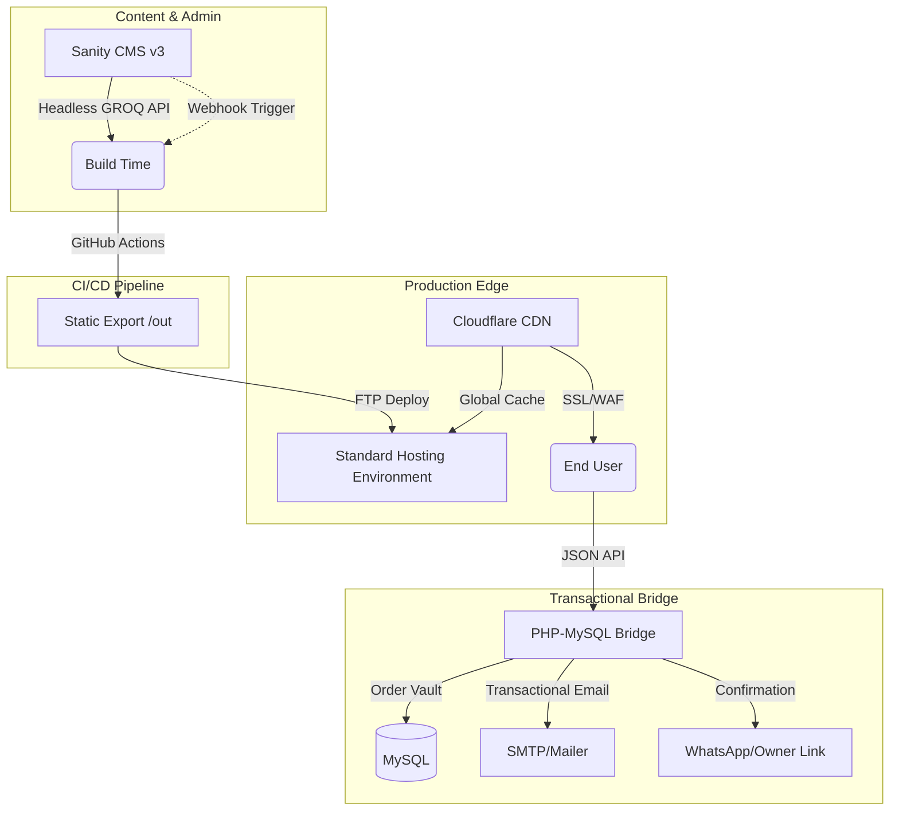

# ZAHIDAAN (زاہدان) 🌿
### *The Devoted Ones | Premium Luxury Attar & Perfume Platform*

ZAHIDAAN is a high-performance, spiritually-aligned e-commerce platform built for a luxury fragrance boutique. It leverages a decoupled **JAMstack Architecture** to deliver sub-second load times, institutional-grade SEO, and a seamless administrative experience.

---

## 🏗 System Architecture

The platform is designed to overcome traditional shared-hosting limitations by decoupling the content management, frontend delivery, and transactional logic.

---

## 💎 Key Features

### 🛍 E-Commerce Core
- **Persistent Shopping System**: State-managed cart using **Zustand** with local storage persistence.
- **Dynamic Product Routing**: Highly optimized dynamic pages generated at build time for instant navigation.
- **The "2-Minute Confirmation Loop"**: A proprietary order-to-owner workflow that ensures verified confirmation via tokenized email/WhatsApp links.
- **Smart Shipping Logic**: Automated detection of local vs. pan-India service areas based on pincode validation.

### 🛡 Admin & Content Control
- **Headless CMS Integration**: Powered by **Sanity.io**, featuring custom schemas for:
    - Multi-tiered product attributes (Top, Heart, and Base notes).
    - Fragrance family classification.
    - Tiered sizing and pricing logic.
- **Real-time Content Updates**: Changes in the Admin Studio trigger automated GitHub rebuilds via a custom PHP Webhook listener.

### 🔍 SEO & Search Visibility
The platform implements a **"Search-First" strategy** to dominate local and national fragrance markets:
- **JSON-LD Structured Data**: Full implementation of `Organization`, `WebSite`, `Product`, and `BreadcrumbList` schemas.
- **Dynamic Metadata**: Title templates and descriptions generated dynamically from CMS data for every product and category.
- **Optimized Asset Delivery**: Sanity CDN handles on-the-fly image cropping, resizing, and WebP conversion.
- **Automated Discovery**: Dynamic sitemaps (`sitemap.xml`) and `robots.txt` generated per build.
- **Analytics & Tracking**: Integrated GA4 with custom event tracking for conversion monitoring.

---

## ⚡ Technical Excellence

- **Luxury Ease Motion**: Custom Framer Motion ease curves (`cubic-bezier(0.16, 1, 0.3, 1)`) designed to reflect the brand's premium identity.
- **Inode-Safe Deployment**: A lean deployment strategy designed to maintain a footprint of <300 files on the production server.
- **Security Hardened**: 
    - Rate-limited API endpoints.
    - Content Security Policy (CSP) headers.
    - Sanitized input handling via custom PHP middleware.
    - Secure token-based confirmation links.

---

## 🛠 Tech Stack

| Layer | Technology |
|---|---|
| **Frontend** | Next.js 14 (App Router), TypeScript, Tailwind CSS 4 |
| **Animation** | Framer Motion |
| **CMS** | Sanity v3 (Headless) |
| **Database** | MySQL (Transactional Orders) |
| **Backend Bridge** | PHP 8.1+ |
| **State Management** | Zustand |
| **Validation** | Zod + React Hook Form |
| **DevOps** | GitHub Actions, Cloudflare, FTP-Deploy |

---

## 🚀 Development & Deployment

### Local Setup
1. Clone the repository.
2. Install dependencies: `npm install` in `/frontend`.
3. Configure `.env.local` with your Sanity Project ID and API Base URL.
4. Run development server: `npm run dev`.

### Deployment Pipeline
Every push to `main` triggers:
1. `npm run build` (Static Export).
2. SSSG (Static Site Generation) for all products.
3. Sitemap regeneration.
4. Automated upload to the production environment via FTP.

---

**© 2026 ZAHIDAAN Attars and Perfumes | Engineered by Pehchanly Digital Solutions**
